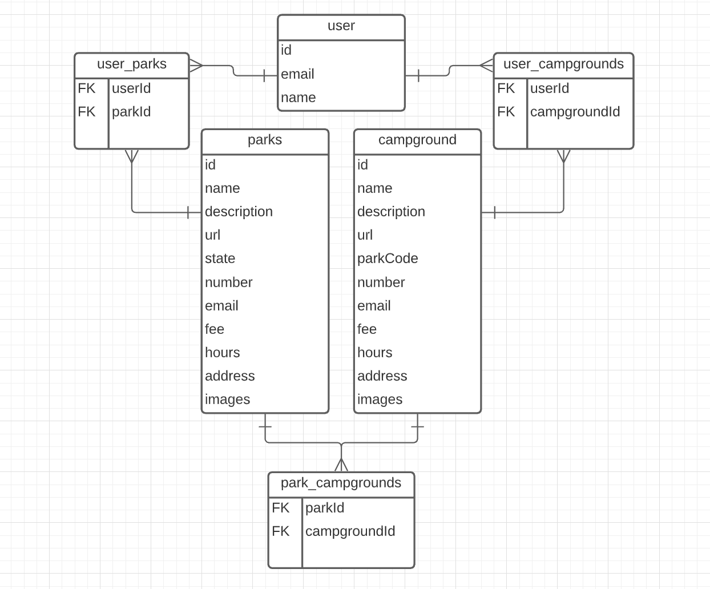

# Front-End Capstone
> I will be creating an application focused on National Parks and hikes near those parks. A user will be able to search for parks and hikes. The user will be able to click on search results to get more information and details on the park/hike.

## [ERD](https://app.lucidchart.com/lucidchart/invitations/accept/f0199779-69ae-499f-94a4-75ddc89fab62)

##[LOOM](https://www.loom.com/share/7acbcdd1e16d4225a66a6aef1523ed83)
> Video walkthrough of the planning process

##[FIGMA](https://www.figma.com/file/DUW61kGBXRGlTmFsXrGnor/NPS-Capstone?node-id=0%3A1)
> Stop by here to checkout my wireframe for this project!
