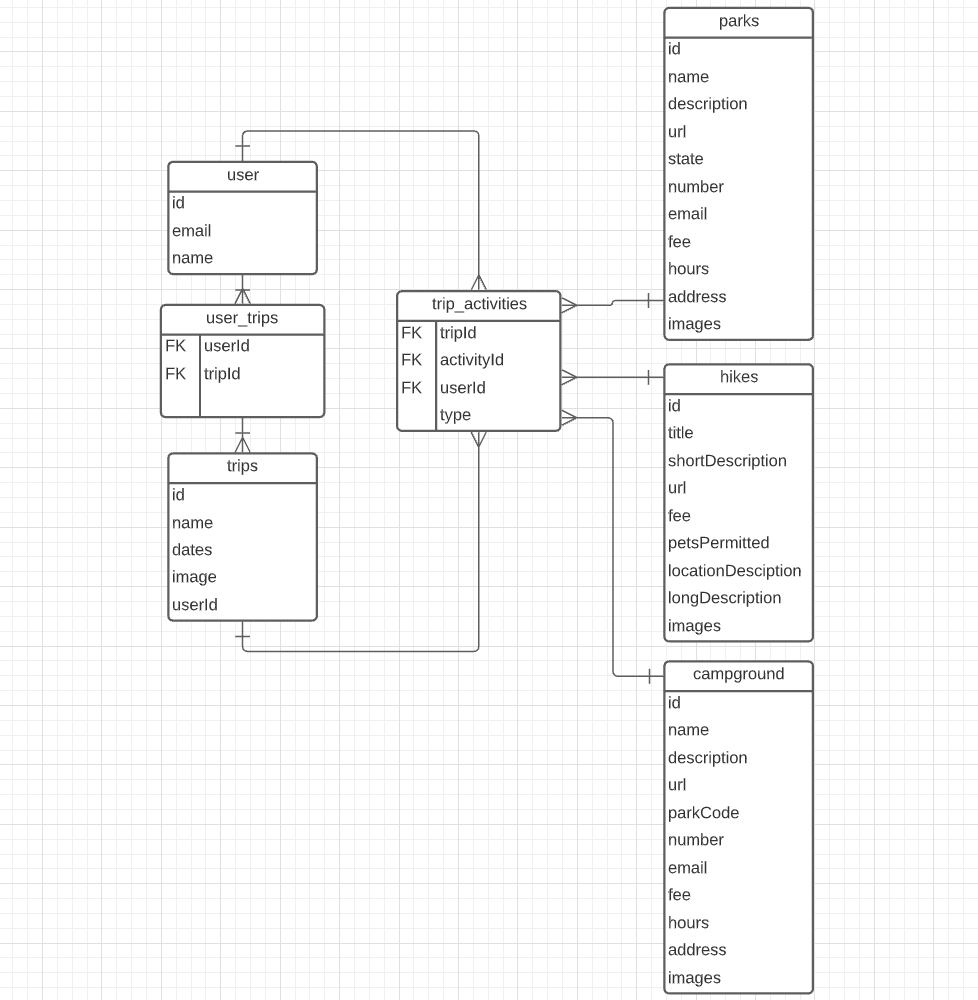

# [Adventure Planner](https://adventure-planner-lb.netlify.app/)
> This application allows users to search for a National Park, find hikes realted to that park, create a trip and save either park or hike to their trip!

## User experience
Start by searching for a National Park! Click through some of the hikes. Find some place you want to explore? Create a trip and add the park/hike to your trip!

## [ERD](https://lucid.app/lucidchart/d6ea5c27-6468-41f9-974c-7f1e945f4d92/edit?beaconFlowId=A0D51951A237376C&page=0_0#)

## [LOOM](https://www.loom.com/share/7acbcdd1e16d4225a66a6aef1523ed83)
> Video walkthrough of the planning process

## [FIGMA](https://www.figma.com/file/DUW61kGBXRGlTmFsXrGnor/NPS-Capstone?node-id=0%3A1)
> Stop by here to checkout my wireframe for this project!

## Demo

## How magic was made
This project was made possible by firebase NPS API, firebase, React, CSS Grid, CSS Flexbox, Bootstrap, Javascript, and SASS.

